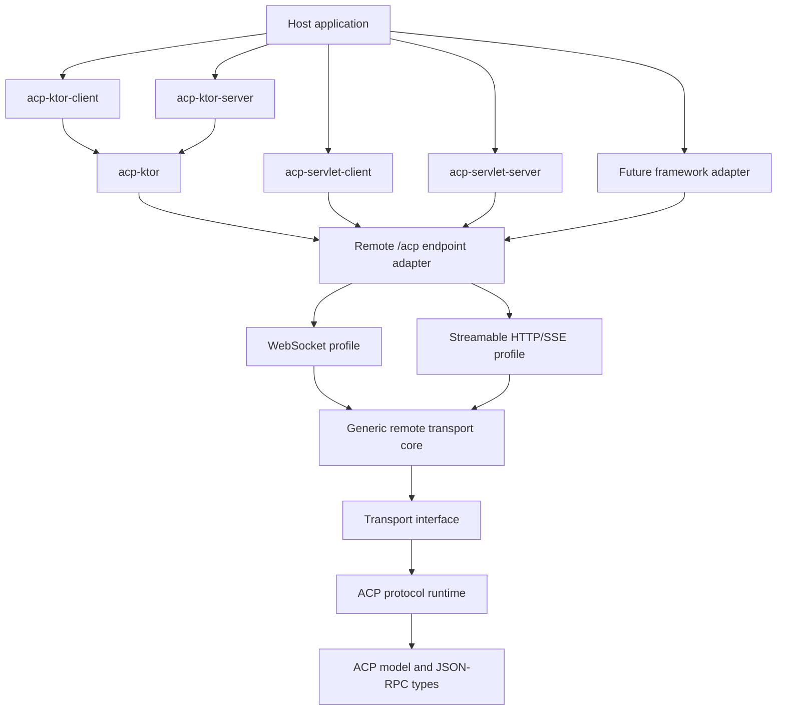

# ACP Kotlin SDK Architecture

This document defines the intended extension architecture for the ACP Kotlin SDK. It is the reference for refactoring transport code, supporting the ACP remote transport profiles, and adding framework-specific integrations.

## Goals

- Keep ACP protocol behavior independent from any web framework.
- Make remote ACP transports reusable across Ktor and future runtimes.
- Support both ACP remote profiles: WebSocket and Streamable HTTP with SSE.
- Keep framework adapters thin, testable, and optional.
- Preserve the current Ktor integration as a first-class adapter.
- Allow applications to integrate ACP by adapting their native HTTP, SSE, and WebSocket APIs instead of forking protocol logic.
- Preserve consumer-facing compatibility where practical while moving implementation internals behind generic boundaries.

## Non-Goals

- A single universal web-framework module that depends on every framework.
- Replacing framework-native WebSocket lifecycles with a custom server runtime.
- Adding more framework support before the existing Ktor transport is split into a reusable remote transport core plus adapter layer.
- Treating WebSocket as the only remote transport profile.
- Guaranteeing production support for Kotlin/JS, Wasm, or Native until those targets are explicitly validated and documented.

## Responsibility Diagram



## Layer Responsibilities

### `acp-model`

Owns the protocol data model and JSON serialization contracts.

Responsibilities:

- ACP request, response, notification, capability, and session types.
- JSON-RPC message types and serializers.
- Protocol version constants and schema-aligned model behavior.

Restrictions:

- No dependency on transports.
- No dependency on web frameworks.
- No host application lifecycle assumptions.

### `acp`

Owns the protocol runtime and transport contract.

Responsibilities:

- `Protocol` request/response correlation.
- Notification dispatch.
- Cancellation behavior.
- Agent and client runtime support.
- The framework-neutral `Transport` interface.
- STDIO transport support.

Restrictions:

- No dependency on Ktor, servlet APIs, Netty APIs, or other web framework APIs.
- No framework-specific authentication, routing, or server lifecycle code.

### Generic Remote Transport Layer

Owns remote ACP transport behavior that is independent of a concrete framework.

Target responsibilities:

- Provide reusable transport behavior for ACP remote profiles.
- Encode and decode ACP JSON-RPC messages shared by WebSocket and Streamable HTTP.
- Define common remote connection state, including connection identity, session stream routing, close, cancellation, and error handling.
- Preserve the ACP lifecycle across both remote profiles.
- Keep profile-specific mechanics isolated behind small abstractions.

Remote profiles:

- WebSocket profile: full-duplex JSON-RPC over text frames.
- Streamable HTTP profile: client-to-server JSON-RPC over `POST`, server-to-client JSON-RPC over long-lived SSE `GET` streams, and connection termination over `DELETE`.

Target restrictions:

- No direct dependency on Ktor, Javax Servlet/WebSocket, or other framework APIs.
- No framework-specific routing or authentication policy.
- No framework-specific session type in public constructor signatures.

The generic layer should model the ACP remote transport endpoint described by the Streamable HTTP and WebSocket transport RFD:

- One `/acp` endpoint.
- `GET /acp` with `Upgrade: websocket` opens the WebSocket profile.
- `GET /acp` without WebSocket upgrade opens an SSE stream.
- `POST /acp` accepts client-to-server JSON-RPC.
- `DELETE /acp` terminates a connection.
- `Acp-Connection-Id` identifies transport connection state.
- `Acp-Session-Id` identifies session-scoped HTTP streams and POSTs.
- Streamable HTTP requires HTTP/2.
- HTTP-based transports must support cookies for connection-scoped affinity.

### WebSocket Profile

Owns WebSocket behavior that is independent of a concrete framework.

Responsibilities:

- Adapt a bidirectional text-frame connection to the generic remote transport core.
- Encode and decode ACP JSON-RPC messages.
- Ignore or reject unsupported binary frames according to the transport policy.
- Close the remote connection when the WebSocket closes.

Implemented abstraction:

```kotlin
public interface AcpWebSocketConnection : AutoCloseable {
    public val incomingTextFrames: Flow<String>
    public suspend fun sendText(text: String)
    override fun close()
}
```

Framework adapters translate native WebSocket APIs into this generic connection contract, then compose `RemoteWebSocketTransport` for shared ACP JSON-RPC framing, send/receive lifecycle, close, and error handling.

### Streamable HTTP/SSE Profile

Owns Streamable HTTP behavior that is independent of a concrete framework.

Responsibilities:

- Accept `initialize` as a special `POST /acp` request that returns `200 OK` with a JSON-RPC response body and `Acp-Connection-Id`.
- Accept other valid `POST /acp` messages and return `202 Accepted` while routing the eventual JSON-RPC response to the correct SSE stream.
- Open connection-scoped SSE streams for connection-level server-to-client messages.
- Open session-scoped SSE streams for session-level server-to-client messages.
- Route server-to-client messages by connection and session identity.
- Terminate connection state on `DELETE /acp`.
- Enforce content negotiation and validation rules that are transport-level rather than framework-specific.

Restrictions:

- No framework-specific HTTP request or response types in the generic implementation.
- No authentication policy beyond accepting caller-provided validated metadata.
- No durability or replay guarantees beyond the current ACP transport version.

Candidate abstraction shapes:

```kotlin
public data class AcpRemoteRequest(
    public val method: AcpRemoteHttpMethod,
    public val headers: AcpRemoteHeaders,
    public val body: String?,
)

public interface AcpSseStream {
    public suspend fun sendEvent(data: String)
    public suspend fun close()
}
```

The exact API should be decided during implementation. The important boundary is that framework adapters own HTTP/SSE primitives, while the generic layer owns ACP remote routing and JSON-RPC behavior.

### `acp-ktor`

Target role: Ktor adapter and shared Ktor-specific helpers.

Responsibilities:

- Adapt Ktor `WebSocketSession` to the WebSocket profile abstraction.
- Adapt Ktor HTTP requests and SSE responses to the Streamable HTTP profile abstraction when HTTP/SSE support is added.
- Keep Ktor-specific imports and lifecycle behavior outside the generic remote transport core.
- Preserve existing Ktor client/server ergonomics where possible.

Restrictions:

- No duplicate protocol logic.
- No Ktor-specific behavior inside the generic remote transport core.

### `acp-ktor-server`

Owns Ktor server route binding.

Responsibilities:

- Bind ACP to a Ktor `Route` or `Application` at the shared `/acp` endpoint.
- Route WebSocket upgrades to the WebSocket profile.
- Route Streamable HTTP `GET`, `POST`, and `DELETE` requests to the HTTP/SSE profile when supported.
- Provide route-level configuration hooks.
- Let applications supply authentication through Ktor-native routing wrappers.

Restrictions:

- Should only compose Ktor routing plus the generic remote transport profiles.
- Should not own protocol semantics.

### `acp-ktor-client`

Owns Ktor client binding.

Responsibilities:

- Open a Ktor client WebSocket session for the WebSocket profile.
- Add Streamable HTTP client support through Ktor HTTP client primitives when implemented.
- Adapt Ktor client primitives into generic remote profile abstractions.
- Return a `Protocol` ready for the caller to start.

Restrictions:

- Should not duplicate remote transport send/receive or routing logic.

### Future JVM Adapters

Target role: optional adapters for JVM stacks that are not already covered by Ktor or the Java SDK.

Likely responsibilities:

- Adapt the target framework's WebSocket APIs to the WebSocket profile abstraction.
- Adapt the target framework's HTTP and SSE APIs to the Streamable HTTP profile abstraction when HTTP/SSE support is added.
- Keep framework dependencies optional and isolated from non-consumers.

Restrictions:

- No dependency from core modules back into framework-specific APIs.
- No duplicate protocol or JSON-RPC handling.
- Prefer adapters that cover Kotlin-first or Atlassian-relevant JVM stacks not already covered by the Java SDK.

### `acp-servlet-server`

Target role: Javax Servlet/JSR-356 WebSocket server adapter.

Responsibilities:

- Adapt `javax.websocket.Session` to the generic WebSocket profile abstraction.
- Register ACP WebSocket endpoints through `javax.websocket.server.ServerContainer`.
- Provide a small `ServletContext` helper for servlet-style hosts.
- Keep Javax Servlet/WebSocket dependencies isolated from Ktor and core consumers.

Restrictions:

- No protocol or JSON-RPC framing logic.
- No Spring-specific configuration or auto-configuration.
- No Jakarta namespace dependency until a separate Jakarta variant is justified.

### `acp-servlet-client`

Target role: Javax/JSR-356 WebSocket client adapter.

Responsibilities:

- Adapt Javax `WebSocketContainer` client connections to the generic WebSocket profile abstraction.
- Provide helpers for callers that already have a `WebSocketContainer` and for callers that want the default `ContainerProvider` container.
- Return a `Protocol` ready for the caller to start, matching the Ktor client helper lifecycle.
- Keep Javax WebSocket dependencies isolated from Ktor and core consumers.

Restrictions:

- No protocol or JSON-RPC framing logic.
- No dependency on `acp-servlet-server`; shared behavior is the generic WebSocket transport in `acp`.
- No Spring-specific client configuration.
- No Jakarta namespace dependency until a separate Jakarta variant is justified.

## Dependency Direction

Allowed dependency direction:

```text
framework adapter -> generic remote transport profiles -> acp -> acp-model
```

Disallowed dependency direction:

```text
acp -> acp-ktor
generic remote transport -> acp-ktor
generic remote transport -> framework adapters
```

## Framework Integration Pattern

Every framework adapter should follow the same pattern:

1. Bind the framework-native `/acp` route or endpoint.
2. Route `GET` with WebSocket upgrade to the WebSocket profile.
3. Route non-upgrade `GET` to the Streamable HTTP SSE profile.
4. Route `POST` to the Streamable HTTP inbound message handler.
5. Route `DELETE` to remote connection termination.
6. Convert framework WebSocket, HTTP request, HTTP response, SSE, cookie, and close/error events into generic remote transport abstractions.
7. Construct `Protocol` through the generic profile implementation.

The adapter should be small enough that behavior can be reviewed as lifecycle mapping, not protocol implementation.

## Testing Strategy

Tests should preserve the layer boundaries:

- Core protocol tests use fake or in-memory `Transport` implementations.
- Generic WebSocket profile tests use fake `AcpWebSocketConnection` implementations.
- Generic Streamable HTTP profile tests use fake HTTP/SSE connection implementations.
- Ktor adapter tests verify Ktor lifecycle mapping and end-to-end compatibility.
- Framework adapter tests, when added, verify lifecycle mapping and end-to-end compatibility.

Existing protocol behavior should remain covered before adding more framework support.

## Compatibility Expectations

The refactor should preserve:

- Existing public protocol and model APIs unless a breaking change is explicitly accepted.
- Existing Ktor server helper behavior where practical.
- Existing Ktor client helper behavior where practical.
- ACP JSON-RPC wire format.

API movement should favor additive compatibility. If a breaking change is unavoidable, document it in the implementation PR and update migration guidance.

Compatibility strategy:

- Keep existing Ktor helper function names and signatures where practical.
- Keep existing artifact coordinates working for current consumers.
- If implementation classes move, leave deprecated typealiases or wrapper classes in the old package when Kotlin allows it.
- Prefer adding new generic APIs alongside existing Ktor APIs before deprecating old Ktor-specific constructors.
- Keep wire compatibility for current WebSocket JSON-RPC behavior.

Tradeoffs:

- Keeping wrapper APIs may temporarily duplicate small construction paths, but it protects consumers while the generic remote layer stabilizes.
- Keeping generic remote transport inside `acp` avoids another dependency for consumers, but increases the core artifact surface.
- Splitting generic remote transport into a new module such as `acp-remote` keeps `acp` smaller, but requires Ktor consumers to receive a new transitive dependency and creates another public artifact to version.
- Full Streamable HTTP support introduces connection/session state that WebSocket does not need; forcing WebSocket through all HTTP state machinery would simplify architecture but may add unnecessary overhead. The preferred approach is a shared remote core with separate profile-specific mechanics.
