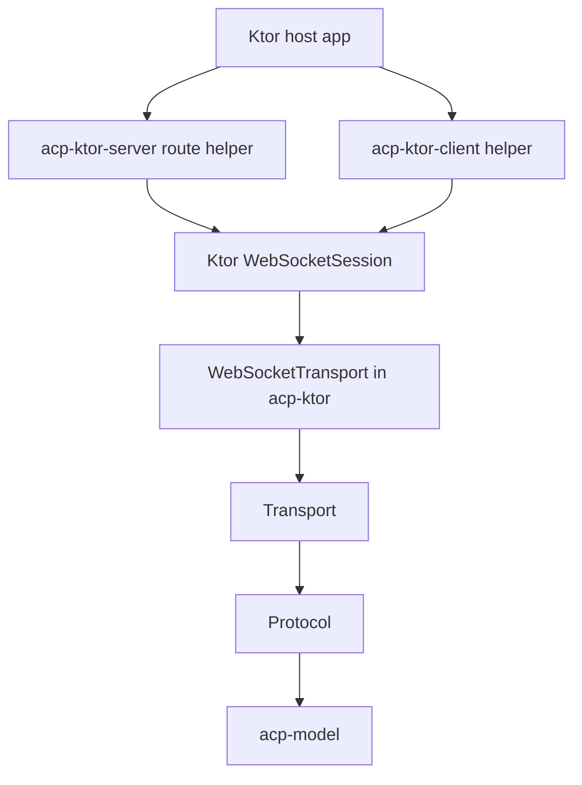
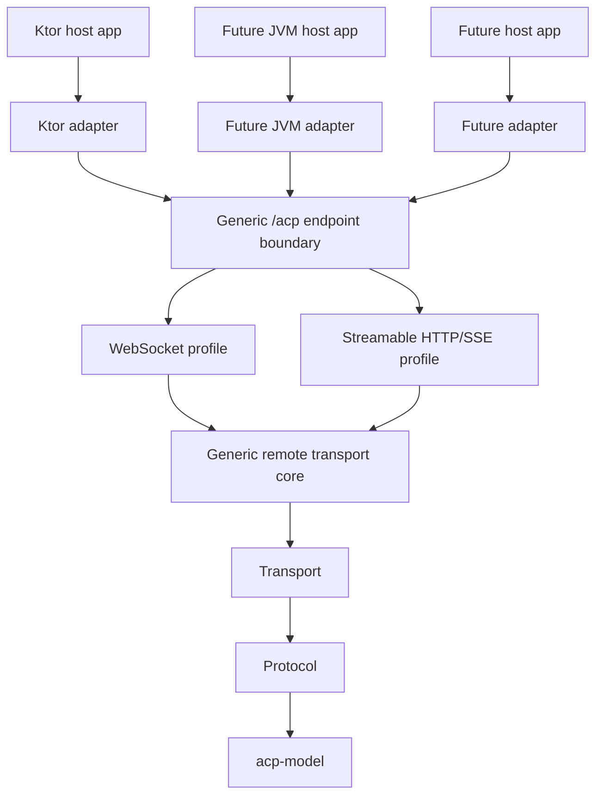

# ACP Runtime Extension Plan

This plan sequences the work required to make the SDK framework-extensible, support ACP remote transport profiles, then add additional non-Spring JVM/Kotlin adapters where they add coverage beyond the Java SDK. It should be used with `ARCHITECTURE.md` as the reference for implementation decisions.

## Objective

Make ACP remote transport support generic enough that Ktor is one adapter rather than the transport implementation, support both WebSocket and Streamable HTTP/SSE profiles, then add the most useful non-Spring JVM/Kotlin adapter through the same extension path.

## Guiding Principles

- Refactor before expanding framework support.
- Preserve the current Ktor behavior while moving reusable logic into a framework-neutral layer.
- Keep each framework adapter optional and isolated in its own artifact.
- Do not duplicate JSON-RPC, protocol, or transport state-machine behavior across adapters.
- Validate the generic path with Ktor before implementing another adapter.
- Maintain source and binary compatibility for consumers where practical.
- Prefer additive APIs, wrappers, and deprecations over removals.
- Treat any unavoidable breaking change as a documented tradeoff requiring explicit acceptance.

## Architecture Change

Before:



After:



The change is to move reusable JSON-RPC transport behavior out of Ktor-owned WebSocket code and into a generic remote transport layer. Ktor keeps its current public integration surface where practical, but becomes an adapter over the same boundary that future framework adapters will use.

## Phase 1: Define the Generic Remote Transport Boundary

Deliverables:

- Decide where the generic remote transport abstractions live.
- Define the minimal public contracts for WebSocket and Streamable HTTP/SSE profiles.
- Define lifecycle expectations for receive, send, close, cancellation, errors, connection identity, and session stream routing.
- Confirm whether the generic remote transport belongs in `acp`, `acp-ktor`, or a new module.
- Define the compatibility strategy for existing Ktor APIs before moving code.

Preferred direction:

- Keep `Transport` in `acp`.
- Introduce a framework-neutral remote transport core outside Ktor-specific modules.
- Include a WebSocket profile and a Streamable HTTP/SSE profile in the architecture, even if implementation is staged.
- Keep Ktor server/client helpers as adapters over the generic remote transport.

Acceptance criteria:

- The boundary is documented in code comments and reflected in module dependencies.
- Generic remote transport code has no Ktor or other framework imports.
- Ktor-specific code only adapts Ktor APIs and wires protocol construction.
- Existing public Ktor entry points have a preservation or deprecation plan.

## Phase 2: Refactor Existing Ktor WebSocket Code Compatibly

Deliverables:

- Extract the current Ktor-dependent `WebSocketTransport` behavior into a generic WebSocket profile implementation.
- Add a Ktor adapter for `WebSocketSession`.
- Update `acp-ktor-server` to compose the Ktor adapter with the generic transport.
- Update `acp-ktor-client` to compose the Ktor adapter with the generic transport.
- Preserve current helper function names where practical.
- Add deprecated wrappers or typealiases if public implementation types need to move.

Implementation notes:

- Start from the current `acp-ktor/src/commonMain/kotlin/com/agentclientprotocol/transport/WebSocketTransport.kt`.
- Move JSON encoding/decoding and send/receive loop behavior to the generic WebSocket profile.
- Leave Ktor frame conversion and session close/flush behavior in the Ktor adapter.
- Avoid changing `Protocol` unless the transport contract proves insufficient.
- Keep Ktor-facing helper signatures stable unless the old signature blocks correct lifecycle behavior.

Acceptance criteria:

- Existing Ktor tests pass.
- No framework-specific imports exist in the generic WebSocket profile.
- Ktor helpers still expose a straightforward route/client API.
- Public API changes are avoided, wrapped, or documented with migration guidance.
- Current consumers can keep using the existing Ktor dependency path for WebSocket support.

## Phase 3: Strengthen Tests Around the Extension Boundary

Deliverables:

- Add generic WebSocket profile tests using a fake connection.
- Keep or update existing Ktor end-to-end tests.
- Add lifecycle tests for close, cancellation, invalid JSON, and send errors where practical.
- Confirm that the generic WebSocket profile behaves the same regardless of adapter.
- Add compatibility tests or binary API validation updates for preserved Ktor entry points.

Acceptance criteria:

- Tests prove the reusable WebSocket profile without needing Ktor.
- Tests prove the Ktor adapter still works end to end.
- Failure modes are covered at the generic transport level where possible.

## Phase 4: Select and Add the Next JVM/Kotlin WebSocket Adapter

Deliverables:

- Add a Servlet/Jakarta-based Gradle module for WebSocket support.
- Adapt standard JVM WebSocket APIs to the generic WebSocket profile abstraction.
- Provide a minimal server registration helper or endpoint type.
- Add WebSocket integration tests for the Servlet/Jakarta adapter.
- Add README documentation for Servlet/Jakarta usage.

Recommended first target:

- Prefer `acp-servlet-server` over Spring, since Spring apps can use the Java SDK and Atlassian-relevant JVM environments commonly expose servlet-style extension points.
- Start with Javax Servlet/WebSocket compatibility for Atlassian-style Data Center/plugin environments, then add a Jakarta variant only if modern containers need a separate artifact.
- Keep the first adapter server-side and WebSocket-only.
- Keep the manual registration API small before considering container-specific helpers.
- Defer Streamable HTTP/SSE for Servlet/Jakarta until the generic HTTP/SSE profile is designed and proven with Ktor.

Acceptance criteria:

- Servlet/Jakarta environments can expose ACP over WebSocket without depending on Ktor.
- The implementation uses the same generic WebSocket profile as Ktor.
- Servlet/Jakarta dependencies are isolated in `acp-servlet-server`.
- Adapter tests cover a basic ACP session.
- Existing Ktor and core tests still pass.

## Phase 5: Add Streamable HTTP/SSE Remote Profile Design

Deliverables:

- Define server-side connection state for `Acp-Connection-Id`.
- Define session-scoped stream state for `Acp-Session-Id`.
- Define inbound `POST` handling, including special `initialize` behavior.
- Define connection-scoped and session-scoped SSE stream routing.
- Define `DELETE /acp` termination behavior.
- Define content negotiation, HTTP status mapping, HTTP/2 expectations, and cookie handling boundaries.
- Decide whether HTTP/SSE support is server-only first or includes client support in the first pass.

Acceptance criteria:

- The design matches the active ACP Streamable HTTP and WebSocket transport RFD.
- The HTTP/SSE profile design reuses protocol and JSON-RPC logic rather than duplicating it.
- The design does not require breaking existing WebSocket consumers.
- Ktor and future adapters can both implement the same HTTP/SSE boundary.

## Phase 6: Implement Streamable HTTP/SSE for Ktor

Deliverables:

- Add Ktor server routing for `GET`, `POST`, and `DELETE /acp` without WebSocket upgrade.
- Add connection-scoped SSE stream support.
- Add session-scoped SSE stream support.
- Add Streamable HTTP validation and status responses.
- Add tests for initialize, session creation, prompt routing, permission response routing, cancellation, and connection termination.

Acceptance criteria:

- A Ktor server can expose ACP over WebSocket and Streamable HTTP/SSE on the same endpoint.
- Existing WebSocket Ktor consumers continue to work.
- HTTP/SSE tests prove connection and session stream routing.
- Unsupported or invalid requests return documented transport-level statuses.

## Phase 7: Extend the Servlet/Jakarta Adapter to Streamable HTTP/SSE

Deliverables:

- Map Servlet/Jakarta HTTP/SSE APIs to the Streamable HTTP/SSE profile abstraction.
- Provide or extend a server registration helper for the full `/acp` endpoint.
- Add HTTP/SSE integration tests for the Servlet/Jakarta adapter.
- Add README documentation for HTTP/SSE usage.

Acceptance criteria:

- Servlet/Jakarta environments can expose ACP over Streamable HTTP/SSE without depending on Ktor.
- The implementation uses the same generic remote transport profiles as Ktor.
- Tests cover a basic HTTP/SSE ACP session.
- Existing Ktor and core tests still pass.

## Phase 8: Documentation and Migration Guidance

Deliverables:

- Update README module table.
- Document the generic transport model.
- Document Ktor usage after the refactor.
- Document Streamable HTTP/SSE behavior and requirements.
- Document Servlet/Jakarta adapter usage.
- Note any source or binary compatibility changes.
- Document deprecations and replacement APIs.

Acceptance criteria:

- A Ktor user can keep using the SDK with minimal changes.
- Servlet/Jakarta users can identify the correct dependency and setup path.
- Adapter authors can understand how to add another framework.
- Consumers can identify whether they need WebSocket only or full Streamable HTTP/SSE support.

## Compatibility Plan

Compatibility priorities:

- Preserve existing artifact coordinates for current Ktor WebSocket consumers.
- Preserve existing public helper function names where practical.
- Preserve existing WebSocket wire behavior.
- Use additive APIs for the generic remote layer.
- Deprecate old implementation-specific constructors only after replacements exist.

Possible tradeoffs:

- If the public `WebSocketTransport` constructor currently exposes Ktor types, a fully generic implementation cannot keep that constructor as the canonical API. Preferred mitigation: keep a deprecated Ktor-backed wrapper with the same constructor and delegate to the new generic implementation.
- If generic remote transport moves into a new module, current Ktor artifacts should depend on it transitively so existing consumers do not need to add another dependency manually.
- If binary compatibility prevents moving a type cleanly, prefer leaving a compatibility shell in the old module over forcing a breaking change.
- If Streamable HTTP requires new endpoint helpers, add them alongside current WebSocket helpers before combining them into a unified `/acp` helper.

## Proposed Module Shape

Target shape:

```text
acp-model
acp
acp-remote            optional if generic remote transport is split out
acp-ktor
acp-ktor-client
acp-ktor-server
acp-servlet-server     future
acp-servlet-client     future, only if needed
```

If the generic remote transport remains inside `acp`, then `acp-remote` is unnecessary. The implementation should choose the smallest module structure that preserves clean dependencies and consumer compatibility.

## First Implementation Milestone

The first implementation milestone is complete when:

- A generic remote transport boundary exists.
- A generic WebSocket profile abstraction exists.
- The current Ktor `WebSocketTransport` no longer owns generic JSON-RPC send/receive behavior directly against Ktor APIs.
- Ktor server and client integrations still pass tests.
- `ARCHITECTURE.md` still accurately describes the dependency boundaries.
- Existing Ktor consumers have a compatibility path.

## Streamable HTTP/SSE Milestone

The Streamable HTTP/SSE milestone is complete when:

- Ktor can serve the shared `/acp` endpoint with WebSocket upgrade and Streamable HTTP behavior.
- `POST`, `GET`, and `DELETE` transport rules are implemented and tested.
- Connection-scoped and session-scoped SSE streams route messages correctly.
- Existing WebSocket behavior remains compatible.

## Servlet/Jakarta Adapter Milestone

The Servlet/Jakarta WebSocket adapter milestone is complete when:

- Servlet/Jakarta environments can host ACP over WebSocket using the generic remote transport.
- Adapter code is isolated from Ktor code.
- Tests demonstrate a working Servlet/Jakarta WebSocket ACP server path.
- README documents the supported Servlet/Jakarta runtime and setup path.

The Servlet/Jakarta Streamable HTTP/SSE adapter milestone is complete when:

- Servlet/Jakarta environments can host ACP over Streamable HTTP/SSE using the generic remote transport.
- Servlet/Jakarta environments can expose the full `/acp` endpoint shape without depending on Ktor.
- Tests demonstrate a working Servlet/Jakarta HTTP/SSE ACP server path.
- README documents the supported Servlet/Jakarta HTTP/SSE runtime and setup path.
